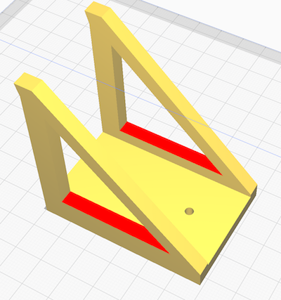
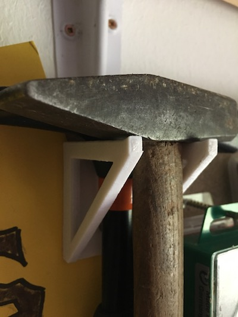
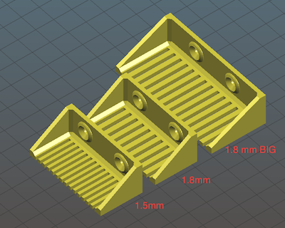
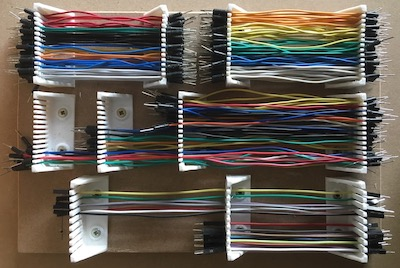
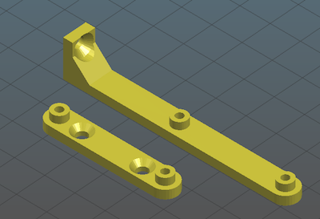
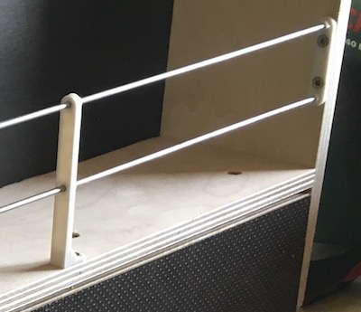

# 3d-models

Collection of some of my 3D printing models

## Models

- hammer holder - to "orgnanize" 1 or 2 hammers
  
  

- cable comb - to organize your breadboard cables
  
  

- shelf fence posts - to build a fence on a shelf
  
  

## License

 This work is licensed under a <a rel="license" href="http://creativecommons.org/licenses/by/4.0/">Creative Commons Attribution 4.0 International License</a>