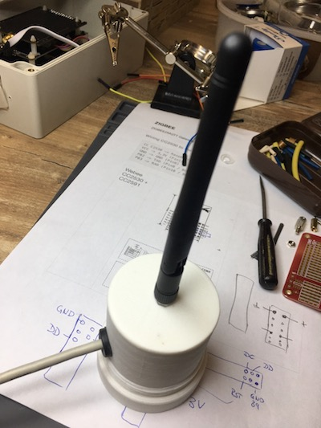
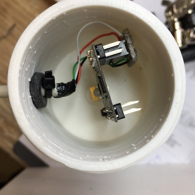
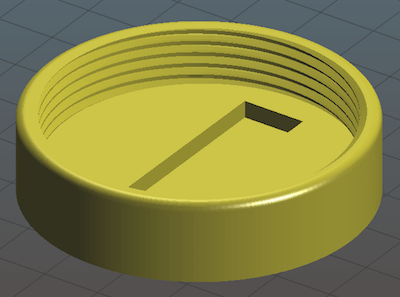
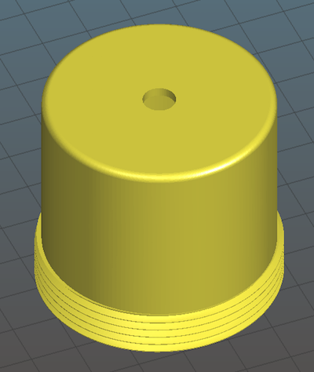

# 3d-models

Collection of some of my 3D printing models, for some models the corresponding STL files can be downloaded from [my MyMiniFactory account](https://www.myminifactory.com/users/thomo) and/or [my thingivers account](https://www.thingiverse.com/ThoMo_1969/designs).

## Models

- hammer holder - to "organize" 1 or 2 hammers

  

  

- cable comb - to organize your breadboard cables

  

  

- shelf fence posts - to build a fence on a shelf

  

  

- ZigBee Case - A case to hold a CC2530+CC2591 board (see [blog post](http://www.handverdrahtet.org/2019/12/setting-up-zigbee2mqtt-gateway.html) & [thingivers](https://www.thingiverse.com/thing:4019004))

  

  

  

  

## License

 This work is licensed under a <a rel="license" href="http://creativecommons.org/licenses/by/4.0/">Creative Commons Attribution 4.0 International License</a>
